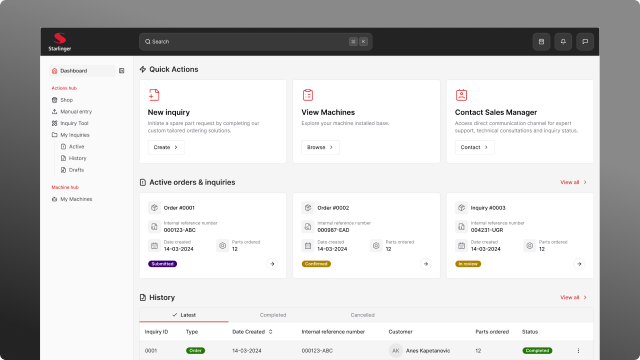
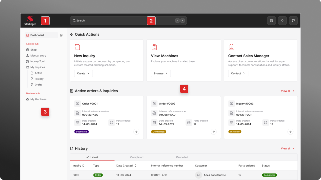

# Getting Started

Welcome to the **Deckard Textile Inquiry Tool**. This comprehensive guide will help you understand and effectively use the platform for all your spare parts inquiries and machine management needs.

## What is the Textile Inquiry Tool?

The Textile Inquiry Tool is a bespoke, state-of-the-art digital platform and Content Management System (CMS) meticulously designed to fundamentally transform how our global clientele interacts with Deckard regarding their machinery needs.

It represents a strategic investment in enhancing customer service, operational efficiency, and ultimately, our competitive edge in the market.

### Core Purpose

At its core, this tool empowers users to:

* Seamlessly submit and manage inquiries
* Provide critical information efficiently
* Track real-time status of requests
* Significantly shorten response times
* Streamline communication processes

## Key Features

This sophisticated digital product is custom-tailored to meet Deckard's unique requirements, integrating several powerful functionalities:

### 1. Integrated Spare Parts Ordering (Webshop Logic)

Facilitates direct, efficient ordering of commonly required genuine Deckard spare and wear parts from available stock.

**Benefits:**
* Functions as a dedicated B2B webshop
* Quick identification and procurement
* Ensures machine uptime
* Reduces ordering time

[Learn more about Shop Mode →](#)

### 2. Comprehensive Manual Inquiry System

Provides a robust mechanism for users to submit detailed inquiries for less common parts, custom requirements, or complex issues.

**Capabilities:**
* Precisely describe part needs
* Specify machine types
* Input part names/numbers
* Provide elaborate descriptions
* Upload supplementary images and files

This structured approach ensures our teams receive all necessary information upfront, reducing back-and-forth communication.

[Learn more about Manual Entry →](#)

### 3. Seamless Communication & CRM Integration

Features a custom-built, secure communication system directly connected to Deckard's core CRM infrastructure.

**Advantages:**
* Centralized client interactions
* Transparent communication
* Immediately accessible to relevant teams
* Enhanced internal collaboration
* Unified customer view

### 4. Centralized Client & Order History

Offers a comprehensive, easily accessible repository of historical data.

**Includes:**
* All previous offers
* Order records
* Associated communication
* Complete inquiry timeline

This provides our sales and service teams with invaluable context, enabling personalized service and informed decision-making.

### 5. Detailed Machine Management & Service Records

Maintains an accurate record of your Deckard machines.

**Tracks:**
* Machine models and types
* Installation dates
* Service history
* Part compatibility
* Maintenance insights

This ensures precise part compatibility, proactive maintenance insights, and efficient support delivery based on your specific machine's lifecycle.

[Learn more about Machine Management →](#)

## Business Benefits

This digital product is engineered to deliver tangible business benefits:

### Enhancing User Engagement
* Transparent, intuitive platform
* Self-service capabilities
* 24/7 access to inquiry tools
* Real-time status updates

### Improving Response Times
* Drastically reduce time from inquiry to resolution
* Automated data capture and routing
* Direct impact on customer satisfaction
* Improved operational efficiency

### Streamlining Operations
* Reduce manual effort
* Enable faster internal processing
* Automated workflows
* Efficient data management

### Supporting Sales Opportunities
* Consolidated view of client history
* Machine data insights
* Identify upsale opportunities
* Targeted product recommendations

### Data-Driven Insights
* Centralized interaction data
* Order analytics
* Trend identification
* Inventory optimization
* Service strategy refinement

## Understanding the User Interface

The design of our application's User Interface (UI) is meticulously crafted to ensure efficiency, intuitive navigation, and a seamless user experience.

### Core UI Elements

#### 1. Navigation Bar (Header)

Positioned prominently at the top, serves as the primary control panel:

* Consistent access to essential functionalities
* Quick navigation between modules
* Account and profile management
* Shopping cart access

#### 2. Global Search Functionality

Integrated within the Navigation Bar:

* Rapid information retrieval
* Predictive text search
* Intelligent filtering
* Quick locate: machines, parts, orders, inquiries

#### 3. Sidebar / Main Menu

Located on the left side:

* Comprehensive main menu
* Logical feature grouping
* Structured access to modules
* Quick access to:
  - Dashboard
  - Shop
  - Manual Entry
  - My Inquiries
  - Machines
  - Settings

#### 4. Application Frame (Content Area)

The dynamic workspace:

* All user interactions
* Data displays
* Form filling
* List presentations
* Feature execution

## Quick Start Guide

### Step 1: Access the Dashboard

After logging in, you'll land on the dashboard which provides:

* Quick actions for creating new inquiries
* Overview of active orders
* Recent activity history
* Direct access to all features

[Learn more about the Dashboard →](#)

### Step 2: Choose Your Inquiry Method

You have three powerful options:

**Option A: Shop Mode**
* Browse 200+ most common parts
* Filter by part number or machine
* Quick add to cart
* Ideal for known parts

**Option B: Manual Entry - Input Form**
* Detailed form for custom requests
* Upload supporting files and images
* Perfect for specialized parts

**Option C: Manual Entry - Template**
* Excel-like interface
* Bulk part entry
* Best for multiple parts

### Step 3: Manage Your Inquiries

Navigate to **My Inquiries** to:

* View active inquiries and status
* Access saved drafts
* Review historical records
* Track order progress

### Step 4: Maintain Your Machine Fleet

Access **My Machines** to:

* View your installed base
* Create machine-specific inquiries
* Download technical brochures
* Track service history

## Need Help?

* Check the [FAQ](#) for common questions
* Browse the [User Guide](#) for detailed instructions
* Review feature-specific documentation
* Contact your sales manager for support

---

**Ready to get started?**

1. [Explore the Dashboard →](#)
2. [Browse the Shop →](#)
3. [Create a Manual Inquiry →](#)
4. [View Your Machines →](#)

In essence, the Textile Inquiry Tool is not just an application; it is a strategic platform for optimized customer interaction and operational excellence, designed to drive efficiency, enhance service delivery, and support Deckard's growth objectives.
