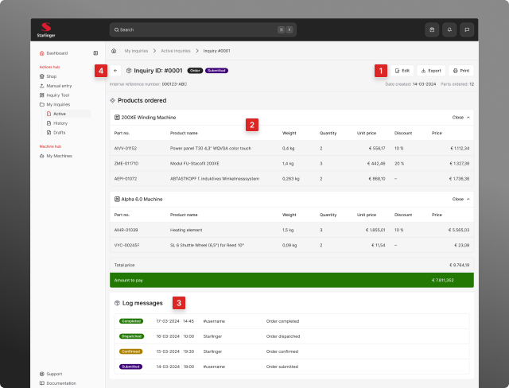

# Managing Inquiries

The Inquiries module provides a centralized dashboard for managing all customer inquiries and orders. The main page features a split-view design for efficient inquiry management.

## Page Structure

The inquiries page is divided into two main sections:

* **Top section:** Active orders and inquiries requiring attention
* **Bottom section:** Historical records of completed or past inquiries

## Key Features

### Viewing Inquiry Details

Access detailed information about any active inquiry by:

1. Clicking directly on the inquiry card, or
2. Clicking the arrow button on the card

This opens a full-page, detailed view with complete inquiry information.

### Viewing All Active Items

To see the complete list of active orders and inquiries:

3. Click the "View all" button located in the Active orders & inquiries section

### Accessing Complete History

To browse all historical records:

4. Click the "View all" button located in the History section

### Managing Historical Items

Control historical inquiries using the actions menu:

5. Click the three dots icon (⋮) on any historical item

### Available Actions:

* **View:** Open the inquiry in read-only mode
* **Archive:** Move the inquiry to archived storage
* **Delete:** Permanently remove the inquiry from the system

## Active Orders & Inquiries

A comprehensive list of all active orders & inquiries sorted by date created.

### Status Indicators

Each inquiry displays a color-coded status indicator:

* **Pending** - Awaiting processing
* **In Progress** - Currently being handled
* **Completed** - Successfully fulfilled
* **Cancelled** - Order was cancelled

## Inquiry Full View

The full view page displays comprehensive details for a selected order or inquiry, providing all information needed for review and processing.

### 1. Available Actions

From the full view, you can:

* **Edit:** Modify inquiry details and information
* **Export:** Download the inquiry data in a portable format
* **Print:** Generate a print-friendly version of the inquiry

### 2. Product Information

The page displays a complete product list including:

* All ordered items
* Individual product prices
* Applied discounts
* Shipping costs
* Total amounts

### 3. System Log

At the bottom of the page, you'll find a chronological log of:

* System-generated status updates
* Process milestones
* Automated notifications
* Activity timestamps

### 4. Navigation

Click on the "Back arrow" button at the top left corner to return to the inquiries list.

## Draft Inquiries

Draft inquiries allow you to save incomplete orders and return to them later.

### Accessing Drafts:

1. Navigate to **My Inquiries > Drafts**
2. Select the draft you want to continue
3. Complete the required information
4. Submit when ready

### Draft Capabilities:

* Edit draft details
* Add or remove items
* Upload additional files
* Delete unwanted drafts
* Submit completed drafts

---

**Tips for Efficient Inquiry Management:**
* Review active inquiries regularly to track progress
* Use the filtering options to find specific inquiries quickly
* Archive completed inquiries to keep your active list clean
* Save drafts when you need time to gather information
* Use the internal reference number for easy tracking
