# Using application

## Dashboard overview

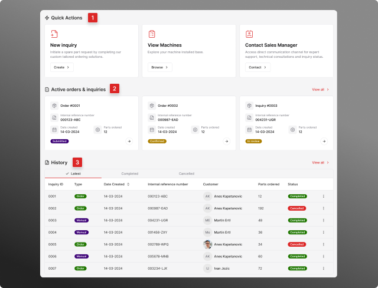

The Dashboard serves as the strategic "command center" and home screen of the application, designed to provide C-level managers and all users with an immediate, high-level overview of critical operational data and quick access to essential functions. Its purpose is to deliver actionable intelligence at a glance, enabling swift decision-making and efficient workflow management.

The Dashboard is meticulously structured into key sections, each serving a vital role in centralizing information and streamlining user interaction:

### 1. Quick Actions

This prominent section is engineered to facilitate immediate and essential user workflows, acting as a shortcut to the most frequently initiated processes. It significantly reduces navigation time and ensures that users can promptly address critical tasks.

Key Action Items:

- **New Inquiry Creation:** Provides a direct pathway to initiate a new spare parts inquiry, whether through the structured "Inquiry Tool" or a "Manual Entry," accelerating the process of addressing part needs.

- **View Machines:** Offers instant access to the user's registered Deckard machine fleet, allowing for quick reference or to dive into machine-specific details and history.

- **Contact Sales Manager:** Enables immediate, direct communication with the assigned regional sales manager, streamlining urgent inquiries or strategic discussions and enhancing customer relationship management.

### 2. Active Orders & Inquiries

This dynamic section provides a real-time snapshot of all currently active orders and inquiries pertinent to the logged-in user. It serves as a live tracking board for ongoing operations.

Typically shows the latest active items with key details such as Order/Inquiry ID, current status (leveraging our color-coded system), and creation date, offering enough context for immediate action or deeper investigation.

### 3. History

This section offers a concise, contextualized view of recent activities, encompassing both the progress of orders/inquiries and significant communication milestones. It provides immediate historical context without requiring deep navigation.

A chronological list of the last 10 relevant actions (e.g., order submissions, status changes, inquiry resolutions). Filtering Options: Enables users to swiftly segment this history for focused review:

- **"Latest":** Default view showing the most recent activities.
- **"Completed":** Highlights successfully concluded orders and inquiries, useful for reviewing fulfilled requests and historical performance.
- **"Cancelled":** Provides visibility into orders or inquiries that did not proceed to completion, aiding in understanding patterns of cancellation or necessary follow-up.

---

## Shop

A list of 200 most common products offered by Deckard.

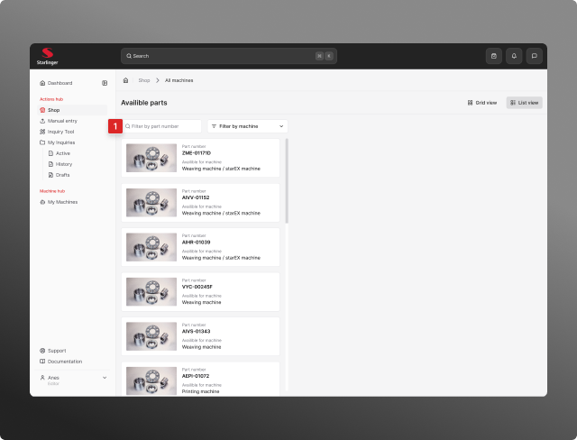

Availible options:

1. Filter by part number - enter complete or partial part numer and narrow down the list of products. It’s a predictive search field

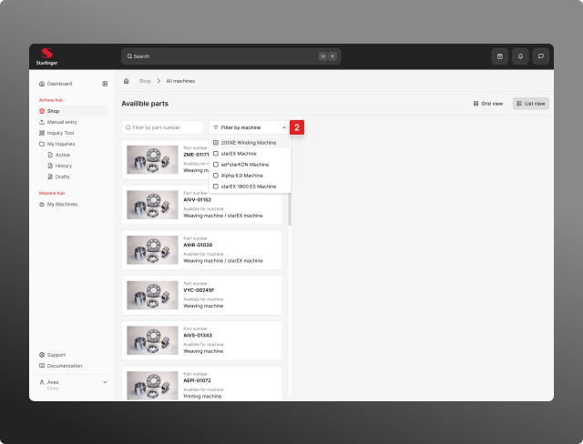

2. Filter by machine - select a matching machine from the dropdown menu.

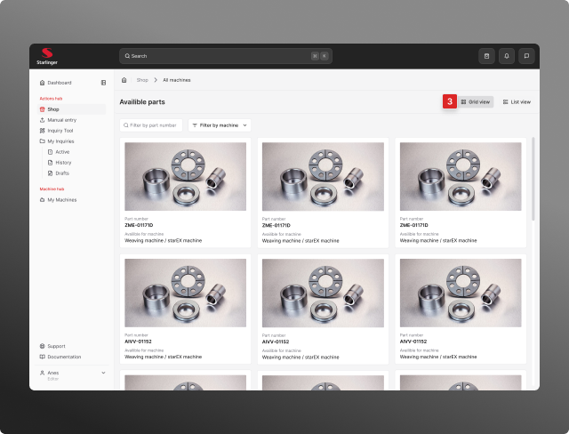

3. Switch grid or list view

### Selecting products

Click on a product in a list or grid view to display product detail page.
You can adjust how many products you want to add to the cart.
Click “Add to cart” if you want to order the product.

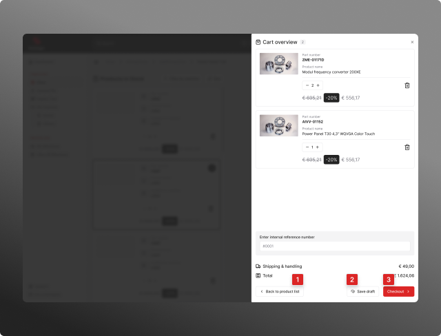

When you add product(s) to the cart, sidebar appears displaying all the items in your cart.
Availible options:

- Back to product list
- Save draft: Saves the order in your Drafts folder so you can continue and finish later
- Checkout: Click if you want to finish the order

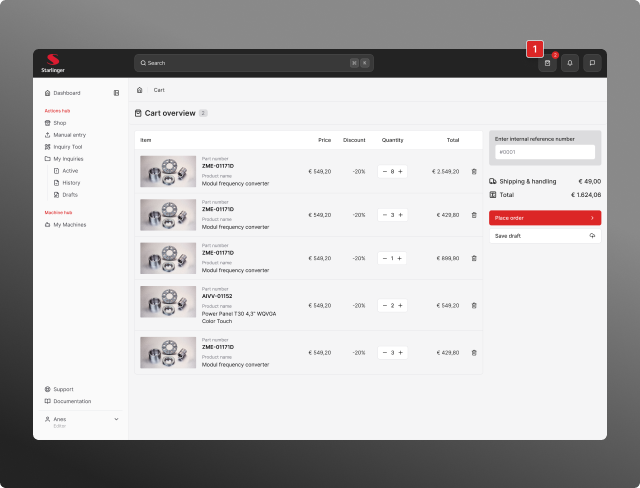

Click on checkout takes you to the cart overview page. You can also access this page by clicking on the cart icon in the main navbar (1).
Please check all the items in your cart before placing the order. You can change quantities or remove products from the order.
**Important! Please enter “Internal reference number”!**

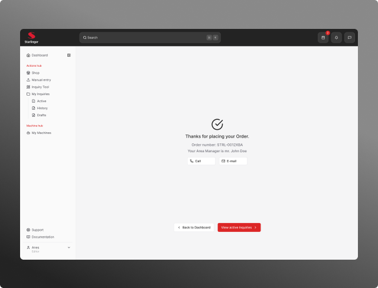

Thank you screen apperas after you place the order.
Availible options:

1. Back to dashboard
2. View active inquiries → takes you to the “My inquiries” section of the app.
3. Call / E-mail → You can make a call or send an email to the area manager.

---

## Manual Entry

Use when have only a partial info about the spare pare or product.

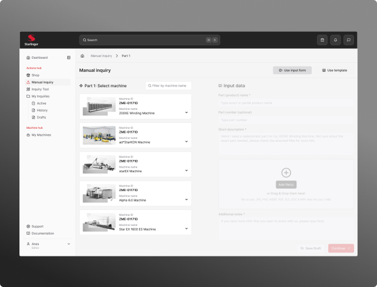

Start with the machine list in the left column and choose your machine (only machines from your installed base are shown!).

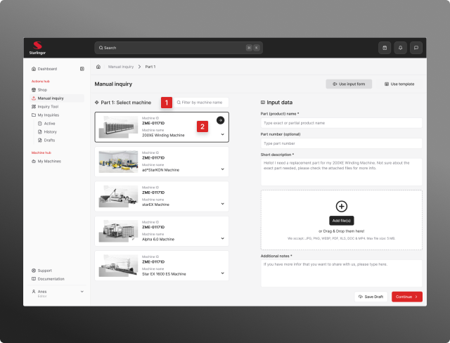

1. You can filter the machine list by typing the machine name in the search field.
2. When you select the machine in the left column you need to enter required data.

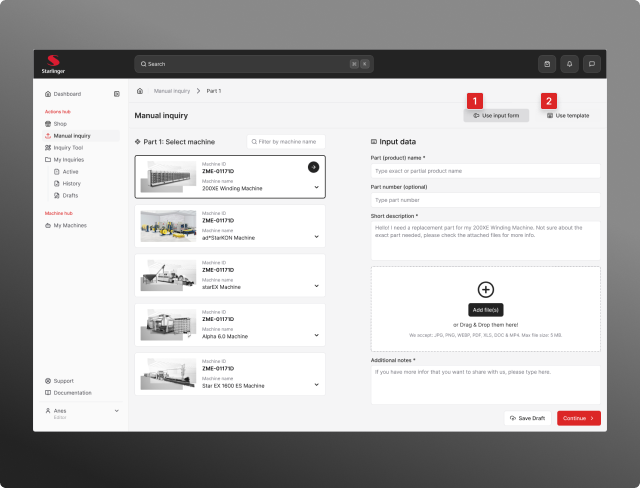

You can choose between two different methods in the upper right corner:

1. Option “A” - Use input form
2. Option “B” - Use template

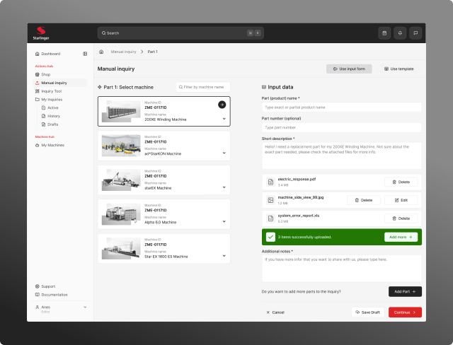

### Option “A” - Use input form

- Please enter all required data in the form.
- Upload additional images or documents that could help Deckard.
- You can add more parts by clicking on the “Add part” button.
- When you finish you can “Save Draft” if you want to continue later or click “Continue” to finish your Manual entry.

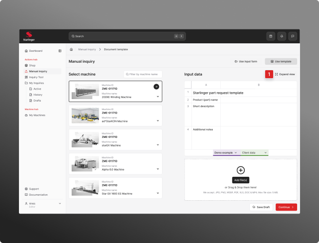

### Option “B” - Use template

- Enter the date you know in the predefined sheet.
- Click on the “Demo example” tab on the bottom to view the best practice approach.
- Click on the “Expand button” (1) in the top right corner to open the sheet in the full screen.
- You can add additional files or images.

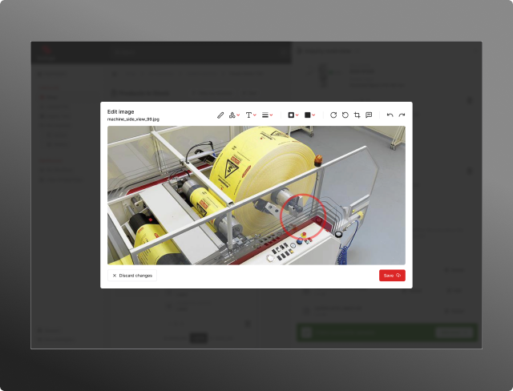

When you click on “Edit” next to image file (.jpg/.png) an simple image editor appears. Here you can write text directly on image or make a visual mark selecting the part of the machine that needs replacement.

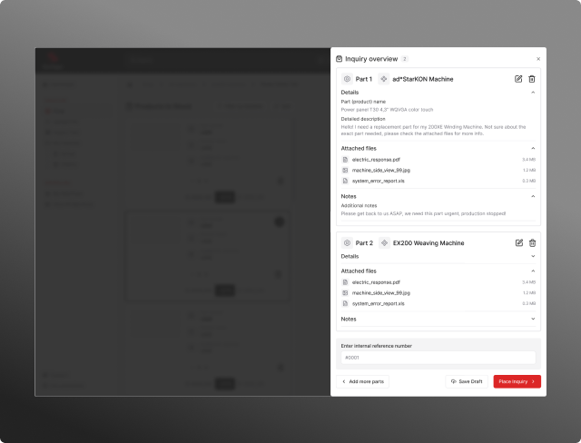

When you add products to “Cart” a sidebar with a list of added products appears. You can edit or remove parts from the list or click “Continue” to move on to the next step in the funnel.

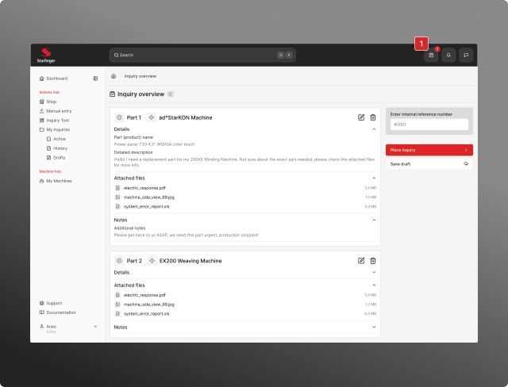

Click on checkout takes you to the cart overview page. You can also access this page by clicking on the cart icon in the main navbar (1).
Please check all the items in your cart before placing the order. You can remove products from the order.
**Important! Please enter “Internal reference number”!**

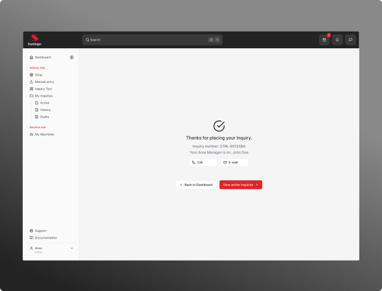

Thank you screen apperas after you place the order.
Availible options:

1. Back to dashboard
2. View active inquiries → takes you to the “My inquiries” section of the app.
3. Call / E-mail → You can make a call or send an email to the area manager.

**Important:** Switching between "Input form" and "Use template" options will reset all unsaved data. You must complete your selection and submit or add items to cart before switching modes. A warning message will appear before any data is lost.

---

## Inquiries Overview

The Inquiries module provides a centralized dashboard for managing all customer inquiries and orders. The main page features a split-view design:

- Top section: Active orders and inquiries requiring attention
- Bottom section: Historical records of completed or past inquiries

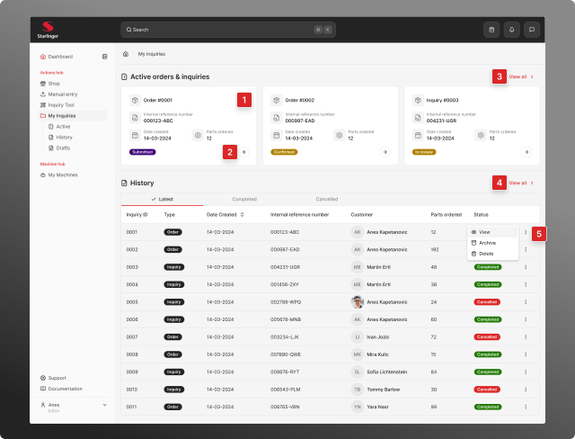

### Key Features

#### Viewing Inquiry Details

Access detailed information about any active inquiry by:

1. Clicking directly on the inquiry card, or
2. Clicking the arrow button on the card

This opens a full-page, detailed view with complete inquiry information.

#### Viewing All Active Items

To see the complete list of active orders and inquiries:

3. Click the "View all" button located in the Active orders & inquiries section

#### Accessing Complete History

To browse all historical records:

4. Click the "View all" button located in the History section

#### Managing Historical Items

Control historical inquiries using the actions menu:

5. Click the three dots icon (⋮) on any historical item and select from the available options:

- **View:** Open the inquiry in read-only mode
- **Archive:** Move the inquiry to archived storage
- **Delete:** Permanently remove the inquiry from the system

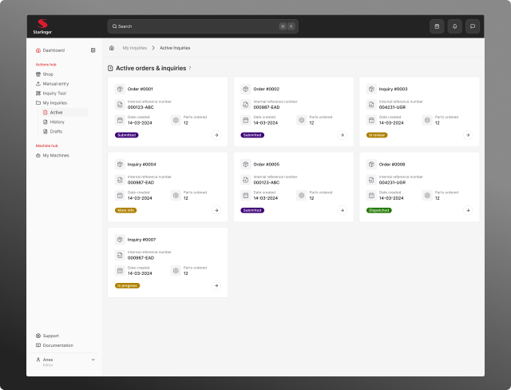

### Active orders & inquiries

A list of all active orders & inquiries sorted by date created.

### Inquiry full view

The full view page displays comprehensive details for a selected order or inquiry, providing all information needed for review and processing.

#### 1. From the full view, you can

- **Edit:** Modify inquiry details and information
- **Export:** Download the inquiry data in a portable format
- **Print:** Generate a print-friendly version of the inquiry

#### 2. Product information

The page displays a complete product list including: All ordered items, Individual product prices, Applied discounts, Shipping costs, Total amounts

#### 3. System Log

At the bottom of the page, you'll find a chronological log of:

- System-generated status updates
- Process milestones
- Automated notifications
- Activity timestamps.

#### 4. Return to the inquiries list 

Click on the "Back arrow" button at the top left corner of the page.

---

## My Machines

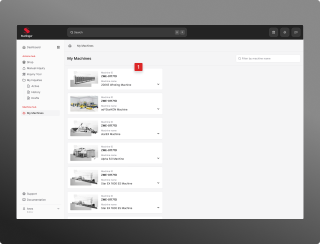

This module displays your complete inventory of installed machines. If your machine list is outdated or incomplete, please contact us to request an update. Click on any machine in the list to open a detailed view in the right-hand panel.

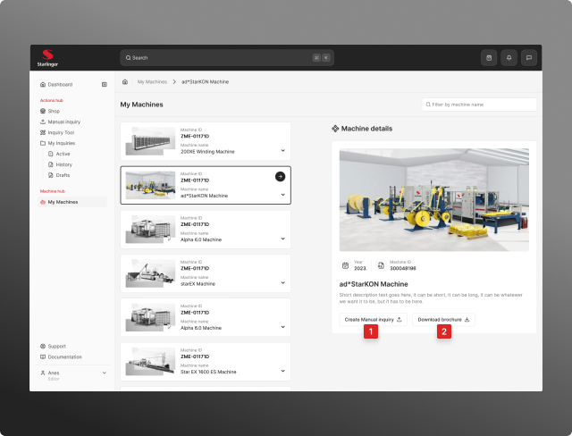

#### Available Actions
From the machine detail view, you can:

1. **Create Manual Inquiry**: Initiate a new inquiry process for the selected machine (see the "Manual Entry" chapter for detailed instructions)
2. **Download Machine Brochure**: Access and download the technical brochure for the machine
